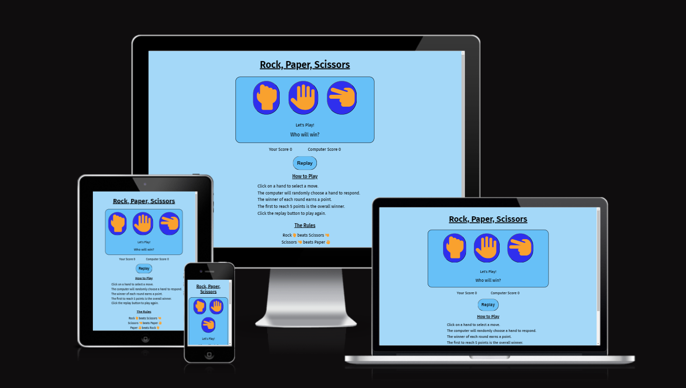
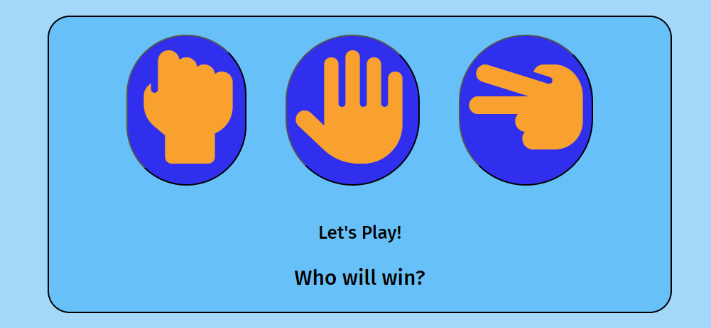
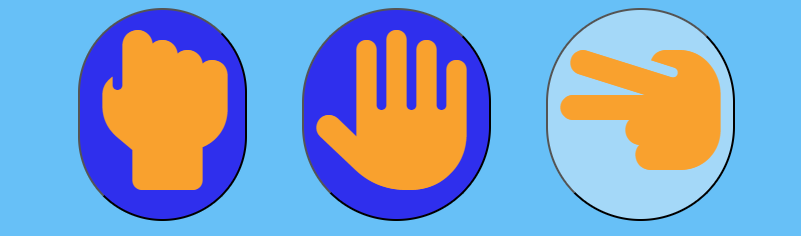
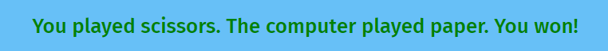
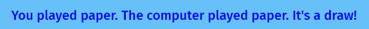
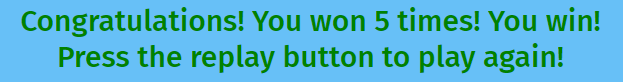
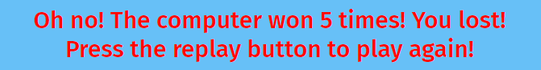

# Rock, Paper, Scissors

Rock, Paper, Scissors is a hand game played between two people where they each choose an "item" represented by a hand shape:
a closed fist is a rock, an open hand is paper and just the index and middle finger extended in a V shape are scissors.

In this game the player plays against the computer, the player makes their selection by clicking on one of the three options and the computer makes a random responce also from one of the three options and the result is displayed on the screen.

The winner is determined by the rules that rock beats scissors (by breaking them), scissors beats paper (by cutting it) and paper beats rock (by covering it).

The overall winner of this game is the first to win five rounds.

## Features

### Heading

The heading is clear, easy to read and tells the user the name of the game.

### Main game area

The main game area is simple and easy to understand, providing the three play buttons for the user to press and messages inviting them to play.

When the user hovers their mouse over the buttons they change colour and the cursor turns into a pointer so the user can see which icon they are going to select.

After each round the "Let's Play!" text updates saying what the user played, what the computer played and who won. If the user won, the text is green, if the computer won, the text is red and if it's a draw the text is blue.

If the user wins five times the "Who will win?" text will update with a message congratulating them in green and informing them they can play again by pressing the replay button.

If the computer wins five times the "Who will win?" text will update with a message telling them they lost in red and informing them they can play again by pressing the replay button.

### Score area

After each round the user and computer scores will increment in the score area until one of them reaches five, this will then update the overall winner text in the game area saying who was first to reach 5 and dissabling the buttons, until the replay button is pressed.

## Testing

* After setting up the HTML, CSS and JavaScript files I checked they were linked by adding a body colour placeholder to the css file and a console.log message to the javascript file. Then opening the preview browser, typing: python3 -m http.server into the terminal. In the preview browser I could see the page was the correct colour and by inspecting the page using DevTools I could see that the message had appeared in the console.

* After adding a click event listener to the buttons I tested that it was responsive, clicking the button should give an alert saying: "You played Rock/Paper/Scissors" depending on which corresponding button was clicked and this worked correctly.

* I tested my computerChoice variable was making a random selection, by using: console.log(computerChoice). When a button was pressed the console would randomly log either "Rock", "Paper" or "Scissors" regardless of what button was pressed.

* I tested my runGame function was working correctly by logging the computerChoice variable to the console and clicking the buttons. If "scissors" were pressed and the console logged "rock" an alert would appear saying "You lost!", if the console logged "paper" the alert would say: "You won!" and if it was scissors the alert would say: "It's a draw!". This worked correctly for all the buttons.

* I tested my incrementPlayerScore and incrementComputerScore functions, when the buttons were clicked the correct alert and console logs appeared and either the player score or computer score increased correctly in-line with the result and if it was a draw neither changed.

* I tested my checkWinner function, if the user score reached 5 the "winner" paragraph reads :"Congratulations! You won 5 times! You win!", if the computer score reaches 5 first the paragraph reads: "Oh no! The computer won 5 times! You lost!"

* I tested that the correct items appeared in the right spans, so what the user and computer played could be seen. Whatever button was clicked the correct word would appear in the player-choice span and in the result paragraph it would say "You played 'the correct thing'". It also did the same for what the computer was selecting, I checked this corresponded to what was being logged by the computer in the console. 

* I changed the colours of the winner and result text depending on the out come, it should be green for a win, red for a loss and blue for a draw, I tested this worked and made sure there was sufficient contrast so that the words were visible.

* When the user hovers over the buttons they should change colour and the mouse turn to a pointer, so the user can see where they will click, I tested this worked correctly in the browser and it did.

* I tested the disablebtn and enablebtn functions, when the score of either the player or computer reaches 5, the icon buttons are disabled and no longer clickable, then reset when the "replay" button is pressed. I tested this worked correctly in the browser and it did.

* I tested the replayGame function and button worked, when the button was pressed it reset all the values.

* I tested the site on Google Chrome, Firefox and Microsoft Edge using both an Asus and Hewlett Packard laptop and Google Chrome and Microsoft Edge on a Google Pixle phone and it works in different browsers.

* I tested the site is responsive on differect screen sizes using google DevTools.

* I confirmed all the content was readable and easy to understand.

### Bugs

* When testing my runGame function I wasn't getting the expected result. The button pressed should have been compared to a random selection from the computer returning an alert, saying either "You won!", "You lost!" or "It's a draw!" depending on how they compared. But no alert would appear, I had already tested that my buttons were working correctly and the computerChoice variable was working, but they wern't comparing to each other. The Tutor team helped me to realise that the strings in my computerChoices array were capitalized, whereas the data-types on the buttons were not, so they couldn't compare.

* I was finding that my incrementPlayerScore and incrementComputerScore functions weren't working. I was getting an error message "unreachable code detected" serching on google I discovered on the stackoverflow.com website that it was because I had put them after a return statement so they wouldn't execute: https://stackoverflow.com/questions/12527060/how-can-i-fix-the-error-unreachable-code-detected

* I was finding my checkWinner function wasn't working, a message was meant to be shown when either the user or the computer reached 5 wins, but nothing would show, on the frrecodecamp.com I was helped to realise that the variables I was trying to call weren't being changed. So I set them to 0 as global variables and increased the relevant one each time in the runGame function: https://forum.freecodecamp.org/t/incrementing-score-and-getting-a-message-when-reaching-a-certain-amount/673829 

### Validator testing

* **HTML** 
  * No errors were returned when passing through the official [W3C Validator](./readme-assets/html_validator_RPS.png)

* **CSS**
  * No errors were found when passing through the official [(Jigsaw) Validator](./readme-assets/CSS_validator_RPS.png)

* **JavaScript**
  * When passing through the JavaScript validator JShint, I got a warning message: Functions declared within loops referencing an outer scoped variable may lead to confusing semantics. I had followed the method used in the love maths tutorial for adding event listeners to buttons, which also gave this warning when passed through [JShint](./readme-assets/JShint-lovemaths.png). I asked one of the tutor team about this and they assured me that it's nothing that will affect my project, so I could leave it as it is. [No warnings were flagged otherwise](./readme-assets/JShint_RPS.png).
  
* **Accessibility**   
  * I confirmed that the aria attributes match their roles, have valid values and are not missspelled and that the colours and fonts used are easy to read and accessible by running it through [lighthouse devtools](./readme-assets/Lighthouse_RPS.png)

## Deployment

* The site was deployed to Git Hub pages using the following steps:
  * In the Github repository, click the settings tab.
  * Under "General" in the subsection "Code and automation" click "Pages".
  * In the "Build and deployment" section, under "Source" select "Deploy from a branch" from the dropdown menu. 
  * Under "Branch" select "Main" from the dropdown menu and save.
  * The link to the website can be found at the top of the page.
  * The deployed website will update automatically with new commits to the master branch. 

## Credits

### Content

* Help understanding and implementing HTML, CSS and JavaScript came from the Code Institute course.

* Help in how to structure and layout a README file came from the Code Institutes [sample README](https://github.com/Code-Institute-Solutions/readme-template?tab=readme-ov-file)

* The favicon used came from [favicon.io](https://favicon.io/emoji-favicons/oncoming-fist).

* The icons used for the buttons and footer came from [fontawesome.com](https://fontawesome.com/).

* I used the code institute [Love maths](https://github.com/Code-Institute-Solutions/love-maths-2.0-sourcecode/) project to help guide me.

* Further help and understanding was sought from [W3schools](https://www.w3schools.com/html/default.asp) the [freecodecamp](https://forum.freecodecamp.org/) and [stackoverflow](https://stackoverflow.com/).

* The responsive appearance on different screen sizes in the readme was obtained from [Am I responsive](https://ui.dev/amiresponsive).

* The Code Institute tutor support team for helping guide me.

* My mentor, Medale Oluwafemi, for his invaluable knowledge and guidance.

